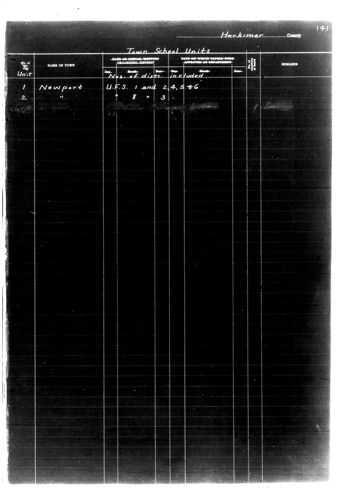

# Herkimer County

**Document Type:** Document

**Collection:** CS Archive

**Source:** District-Consolidation-Data_100-116_page_72.jpg

**Model:** qwen/qwen-vl-plus

**Confidence:** 1.0

**Processed:** 2025-12-19T01:43:30.385769

**Source Image:** [📄 District-Consolidation-Data_100-116_page_72.jpg](../tables/images/District-Consolidation-Data_100-116_page_72.jpg)

---

## Source Document



---

## Transcription

```
Herkimer County
141

Town School Units

| No. of Unit | NAME OF TOWN | DATE ON WHICH SCHOOL-WORKING ORGANIZING DISTRICT WAS FORMED | DATE ON WHICH PAPERS WERE APPROVED BY DEPARTMENT | No. of Board Members | REMARKS |
|-------------|--------------|-------------------------------------------------------------|--------------------------------------------------|----------------------|---------|
|             |              | Day | Month | Year | Day | Month | Year |                      |         |
| 1           | Newport      | U.F.S. 1 and 2, 4, 5, 6                                     | [blank]                                          | [blank]              |         |
| 2           | "            | " 8                                                         | 3                                                | [blank]              |         |
```

**Notes:**
- The table structure is preserved with vertical bars (`|`) separating columns.
- Pre-printed text (e.g., "Town School Units," "NAME OF TOWN") is included as headers.
- Filled-in text (e.g., "Newport," "U.F.S. 1 and 2, 4, 5, 6") is transcribed as is.
- Blank fields are indicated with `[blank]`.
- Alignment is maintained where meaningful (e.g., date columns are aligned under "Day," "Month," "Year").
