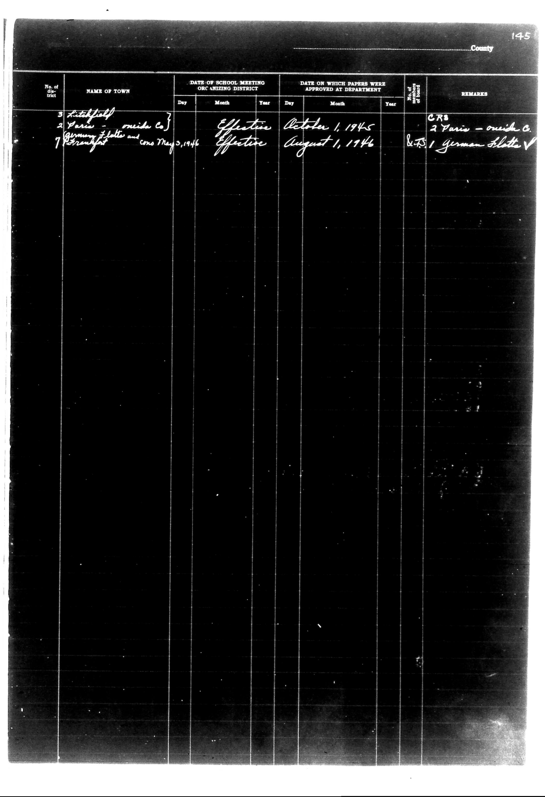

# | No. of district | NAME OF TOWN | DATE OF SCHOOL MEETING ORGANIZING DISTRICT | 

**Document Type:** Document

**Collection:** CS Archive

**Source:** District-Consolidation-Data_100-116_page_75.jpg

**Model:** qwen/qwen-vl-plus

**Confidence:** 1.0

**Processed:** 2025-12-19T01:44:16.294401

**Source Image:** [📄 District-Consolidation-Data_100-116_page_75.jpg](../tables/images/District-Consolidation-Data_100-116_page_75.jpg)

---

## Source Document

---

## Transcription

| No. of district | NAME OF TOWN | DATE OF SCHOOL MEETING ORGANIZING DISTRICT |  |  | DATE ON WHICH PAPERS WERE APPROVED AT DEPARTMENT |  |  | No. of School | REMARKS |
|-----------------|--------------|--------------------------------------------|----|----|----------------------------------------------------|----|----|----------------|---------|
|                 |              | Day                                        | Month | Year | Day                                                | Month | Year |                |         |
| 3               | Litchfield | 2 Vari - oneida Co. | Effective | October 1, 1945 | Effective | August 1, 1946 | CR8 | 2 Vari - oneida Co. | 8.75 / german flotte V |
|                 |              | Germany flotte and Co. May 2, 1946 |           |           |           |           |           |           |           |
