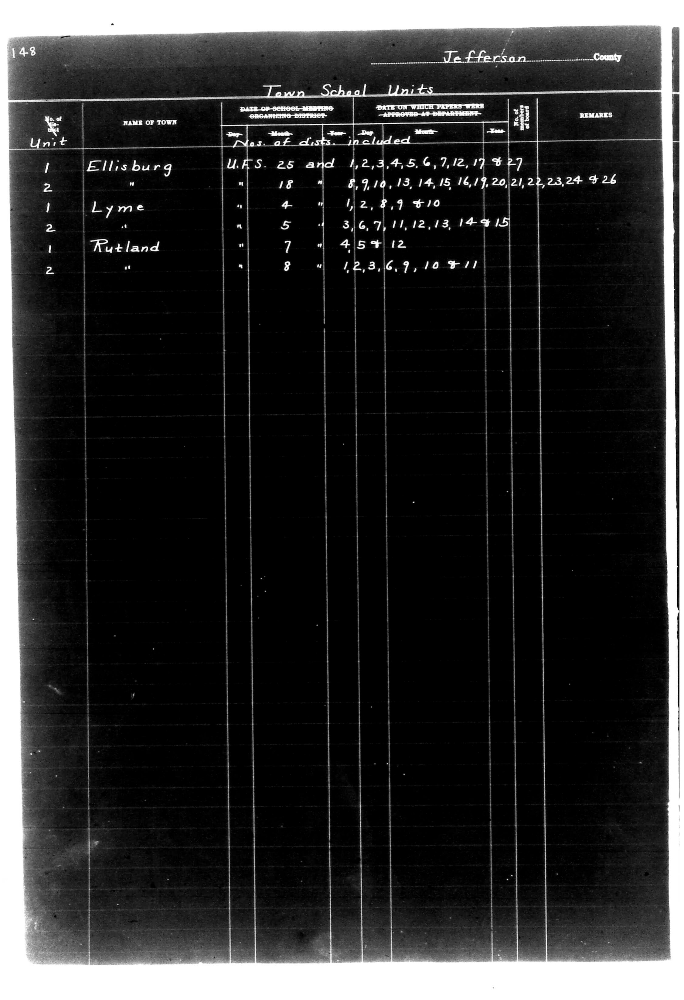

# 148                                                                 Jefferson Co

**Document Type:** Document

**Collection:** CS Archive

**Source:** District-Consolidation-Data_100-116_page_77.jpg

**Model:** qwen/qwen-vl-plus

**Confidence:** 1.0

**Processed:** 2025-12-19T01:44:29.264096

**Source Image:** [📄 District-Consolidation-Data_100-116_page_77.jpg](../tables/images/District-Consolidation-Data_100-116_page_77.jpg)

---

## Source Document



---

## Transcription

```
148                                                                 Jefferson County

Town School Units

| Unit | NAME OF TOWN | DATE OF SCHOOL MEETING ORGANIZING DISTRICT | DATE ON WHICH TOWERS WERE APPROVED BY DEPARTMENT | REMARKS |
|------|--------------|--------------------------------------------|--------------------------------------------------|---------|
|      |              |                                            |                                                  |         |
| 1    | Ellisburg    | U.F.S. 25 and                              | 1,2,3,4,5,G,7,12,17 & 27                          |         |
| 2    |              | 18                                         | 8,9,10,13,14,15,16,19,20,21,22,23,24 & 26        |         |
| 1    | Lyme         | 4                                          | 1,2,8,9 & 10                                     |         |
| 2    |              |                                            |                                                  |         |
| 1    | Rutland      | 5                                          | 3,G,7,11,12,13,14 & 15                           |         |
| 2    |              | 7                                          | 4,5 & 12                                         |         |
|      |              | 8                                          | 1,2,3,G,9,10 & 11                                |         |
```

**Notes:**

- The table is structured with columns for "Unit," "Name of Town," "Date of School Meeting Organizing District," "Date on Which Towers Were Approved by Department," and "Remarks."
- Handwritten entries are preserved as they appear in the original document.
- Blank fields are indicated where no information is provided.
- Pre-printed text (e.g., "Town School Units," column headers) is included as part of the table structure.
- Alignment is maintained for readability, with each column clearly separated by vertical lines (`|`).
