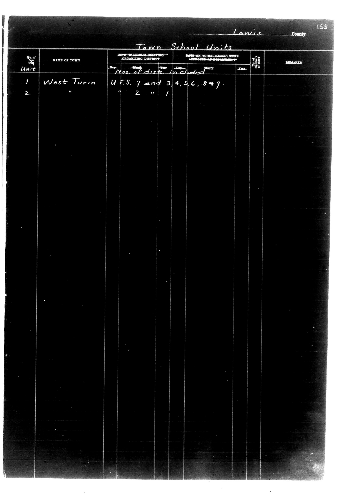

# Lewis County

**Document Type:** Document

**Collection:** CS Archive

**Source:** District-Consolidation-Data_100-116_page_82.jpg

**Model:** qwen/qwen-vl-plus

**Confidence:** 1.0

**Processed:** 2025-12-19T01:45:40.966069

**Source Image:** [📄 District-Consolidation-Data_100-116_page_82.jpg](../tables/images/District-Consolidation-Data_100-116_page_82.jpg)

---

## Source Document

---

## Transcription

Lewis County
155

Town School Units

| No. of Unit | NAME OF TOWN | DATE OF SCHOOL MEETING ORGANIZING DISTRICT | Nos. of dists. included | DATE ON WHICH PAPERS WERE APPROVED AT DEPARTMENT | No. of cert. | REMARKS |
|-------------|--------------|--------------------------------------------|--------------------------|---------------------------------------------------|--------------|---------|
| 1           | West Turin   | U.F.S. 7 and 3, 4, 5, 6, 8, 9             | [blank]                  | [blank]                                           | [blank]      | [blank] |
| 2           | "            | " 2 "                                      | 1                        | [blank]                                           | [blank]      | [blank] |
