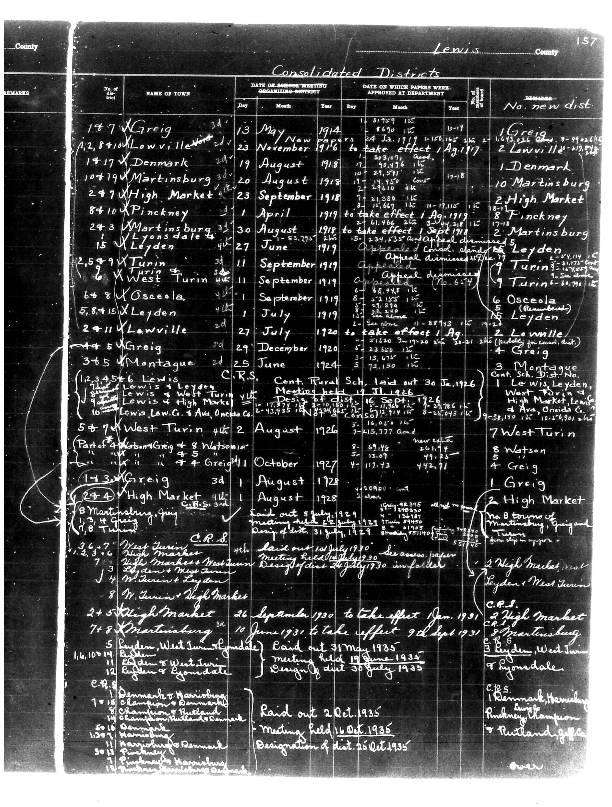

# Below is the transcription of the tabular data from the document, preserving the

**Document Type:** Document

**Collection:** CS Archive

**Source:** District-Consolidation-Data_100-116_page_83.jpg

**Model:** qwen/qwen-vl-plus

**Confidence:** 1.0

**Processed:** 2025-12-19T01:46:01.627368

**Source Image:** [📄 District-Consolidation-Data_100-116_page_83.jpg](../tables/images/District-Consolidation-Data_100-116_page_83.jpg)

---

## Source Document

---

## Transcription

Below is the transcription of the tabular data from the document, preserving the structure and formatting as requested:

---

**Lewis County**

**Consolidated Districts**

| No. of Dist. | NAME OF TOWN | DATE OF SCHOOL MEETING ORGANIZING DISTRICT | DATE ON WHICH PAPERS WERE APPROVED AT DEPARTMENT | No. new dist | REMARKS |
|--------------|--------------|---------------------------------------------|--------------------------------------------------|--------------|---------|
|              |              | Day Month Year                              | Day Month Year                                   |              |         |
| 147          | Greig        | 13 May 1914                                 | 24 Jan 1917                                      | 1 Greig      |         |
|              |              |                                             |                                                  |              |         |
| 1417         | Denmark      | 19 August 1918                              | 17 Aug 1918                                      | 1 Denmark    |         |
|              |              |                                             |                                                  |              |         |
| 10419        | Martinsburg  | 20 August 1918                              | 24 Aug 1918                                      | 10 Martinsburg |         |
|              |              |                                             |                                                  |              |         |
| 247          | High Market  | 23 September 1918                           | 3 Sep 1918                                       | 2 High Market |         |
|              |              |                                             |                                                  |              |         |
| 8410         | Pinckney     | 1 April 1919                                | 1 Aug 1919                                       | 8 Pinckney   |         |
|              |              |                                             |                                                  |              |         |
| 243          | Martinsburg  | 30 August 1918                              | 1 Sep 1918                                       | 2 Martinsburg |         |
|              |              |                                             |                                                  |              |         |
| 15           | Leyden       | 27 June 1919                                | 25 Jun 1919                                      | 5 Leyden     |         |
|              |              |                                             |                                                  |              |         |
| 2,549        | Turin        | 11 September 1919                           | 11 Sep 1919                                      | 9 Turin      |         |
|              |              |                                             |                                                  |              |         |
| 8            | West Turin   | 11 September 1919                           | 11 Sep 1919                                      | 2 West Turin |         |
|              |              |                                             |                                                  |              |         |
| 648          | Osecola      | 1 September 1919                            | 1 Sep 1919                                       | 5 Osecola    |         |
|              |              |                                             |                                                  |              |         |
| 5,8415       | Leyden       | 1 July 1919                                 | 27 Jul 1919                                      | 5 Leyden     |         |
|              |              |                                             |                                                  |              |         |
| 2+11         | Lowville     | 27 July 1920                                | 1 Aug 1919                                       | 2 Lowville   | (publicity for canal) |
|              |              |                                             |                                                  |              |         |
| +5           | Greig        | 29 December 1920                            | 20 Dec 1920                                      | 4 Greig      |         |
|              |              |                                             |                                                  |              |         |
| 3+5          | Montague     | 25 June 1924                                | 30 Jun 1924                                      | 3 Montague   | Cent. Rural Sch. Laid out 30 Jun 1926 |
|              |              |                                             |                                                  |              |         |
| 1,23456      | Lewis        | 17 November 1926                            | 17 Nov 1926                                      | 1 Lewis      | C.R.S. Cent. Rural Sch. Meeting held 17 Nov 1926 |
|              |              |                                             |                                                  |              |         |
| 10           | Lewis        | 26 September 1926                           | 26 Sep 1926                                      | 7 West Turin | West Turin, Lewis, High Market, Lewis C. Co. Ave., Onedia Co. |
|              |              |                                             |                                                  |              |         |
| 5+7          | West Turin   | 4 August 1926                               | 4 Aug 1926                                       | 8 Watson     | Part of 4 West Turin |
|              |              |                                             |                                                  |              |         |
| 1+3          | Greig        | 1 August 1928                               | 1 Aug 1928                                       | 1 Greig      | C.R.S. |
|              |              |                                             |                                                  |              |         |
| 2+4          | High Market  | 1 August 1928                               | 1 Aug 1928                                       | 2 High Market | C.R.S. |
|              |              |                                             |                                                  |              |         |
| 8            | Martinsburg  | 31 July 1930                                | 31 Jul 1930                                      | 3 High Market | Laid out 31 July 1930 Design of dist. 31 July 1930 |
|              |              |                                             |                                                  |              |         |
| 2+5          | High Market  | 26 September 1930                           | 26 Sep 1930                                      | 3 High Market | to take effect 1 Jan 1931 |
|              |              |                                             |                                                  |              |         |
| 7+8          | Martinsburg  | 10 June 1930                                | 10 Jun 1930                                      | 3 Martinsburg | to take effect 9 Sep 1931 |
|              |              |                                             |                                                  |              |         |
| 5            | Leyden       | 31 May 1935                                 | 31 May 1935                                      | 5 Leyden     | Laid out 31 May 1935 Meeting held 19 June 1935 Designation of dist. 25 Oct 1935 |
|              |              |                                             |                                                  |              |         |
| 8            | Turin        |
