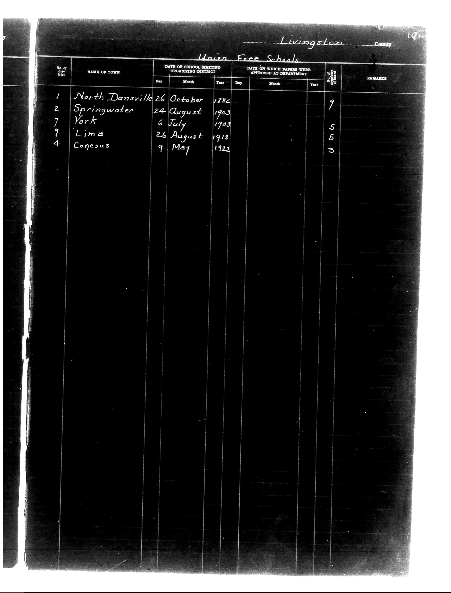

# Livingston County

**Document Type:** Document

**Collection:** CS Archive

**Source:** District-Consolidation-Data_100-116_page_85.jpg

**Model:** qwen/qwen-vl-plus

**Confidence:** 1.0

**Processed:** 2025-12-19T01:46:26.602757

**Source Image:** [📄 District-Consolidation-Data_100-116_page_85.jpg](../tables/images/District-Consolidation-Data_100-116_page_85.jpg)

---

## Source Document



---

## Transcription

```
Livingston County

Union Free Schools

| No. of District | NAME OF TOWN   | DATE OF SCHOOL MEETING ORGANIZING DISTRICT | DATE ON WHICH PAPERS WERE APPROVED AT DEPARTMENT | NUMBER OF SCHOOLS | REMARKS |
|-----------------|----------------|--------------------------------------------|--------------------------------------------------|-------------------|---------|
|                 |                | Day   Month   Year                         | Day   Month   Year                               |                   |         |
| 1               | North Dansville| 26    October 1882                           |                                                  | 9                 |         |
| 2               | Springwater    | 24    August 1903                            |                                                  | 9                 |         |
| 7               | York           | 6     July  1903                             |                                                  | 5                 |         |
| 9               | Lima           | 26    August 1918                            |                                                  | 5                 |         |
| 4               | Conesus        | 9     May   1922                             |                                                  | 3                 |         |
```

**Notes:**
- The table is structured with columns for district number, town name, date of school meeting, approval date, number of schools, and remarks.
- Dates are filled in for the "DATE OF SCHOOL MEETING ORGANIZING DISTRICT" column.
- The "DATE ON WHICH PAPERS WERE APPROVED AT DEPARTMENT" column is blank for all entries.
- The "NUMBER OF SCHOOLS" column contains filled-in numbers.
- The "REMARKS" column is blank for all entries.
- Pre-printed text includes headers like "Livingston County," "Union Free Schools," and column labels.
- Handwritten entries are present for town names, dates, and the number of schools.
