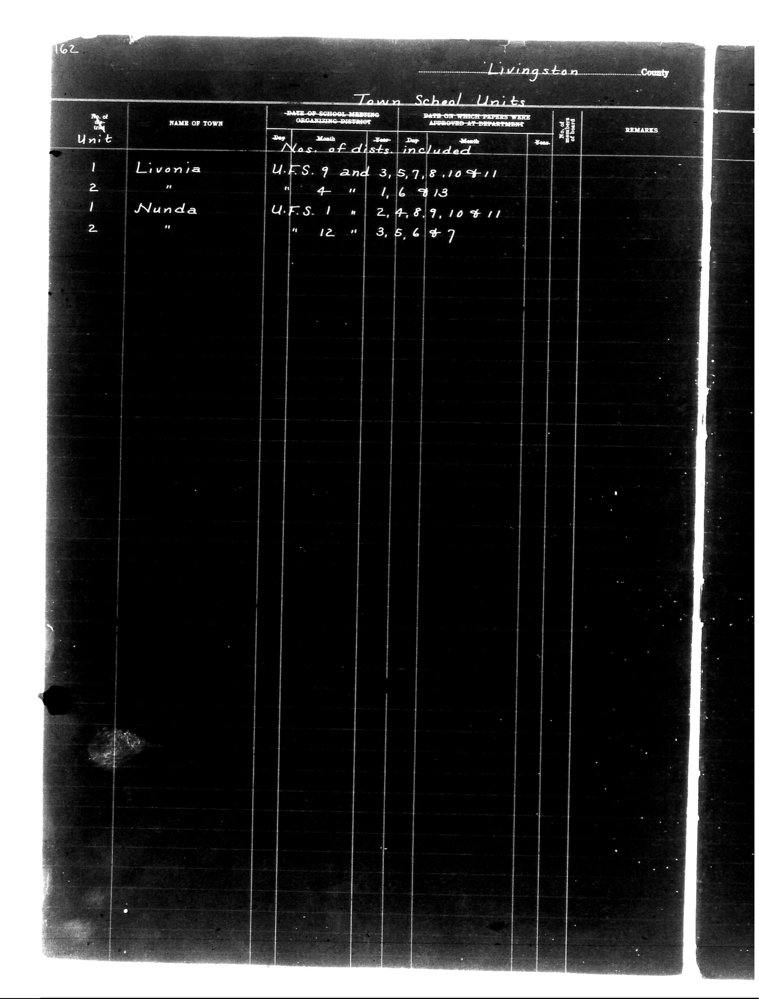

# District Consolidation Data 100 116 page 86

**Document Type:** Document

**Collection:** CS Archive

**Source:** District-Consolidation-Data_100-116_page_86.jpg

**Model:** qwen/qwen-vl-plus

**Confidence:** 1.0

**Processed:** 2025-12-19T01:46:31.595311

**Source Image:** [📄 District-Consolidation-Data_100-116_page_86.jpg](../tables/images/District-Consolidation-Data_100-116_page_86.jpg)

---

## Source Document

---

## Transcription

162
Livingston County

Town School Units

| Unit | NAME OF TOWN | DATE OF SCHOOL-MEETING ORGANIZING-DISTRICT | DATE ON WHICH PAPERS WERE APPROVED AT DEPARTMENT | Nos. of dists. included | REMARKS |
|------|--------------|--------------------------------------------|--------------------------------------------------|------------------------|---------|
|      |              | Day | Month | Year | Day | Month | Year |                      |         |
| 1    | Livonia      |     |       |      |     |       |      | U.F.S. 9 and 3, 5, 7, 8, 10 & 11     |         |
| 2    |              |     |       |      | 4   |       | 13   |                                      |         |
| 1    | Nunda        |     |       |      |     |       |      | U.F.S. 1, 2, 4, 8, 9, 10 & 11        |         |
| 2    |              |     |       |      | 12  |       | 7    | 3, 5, 6 & 7                          |         |
