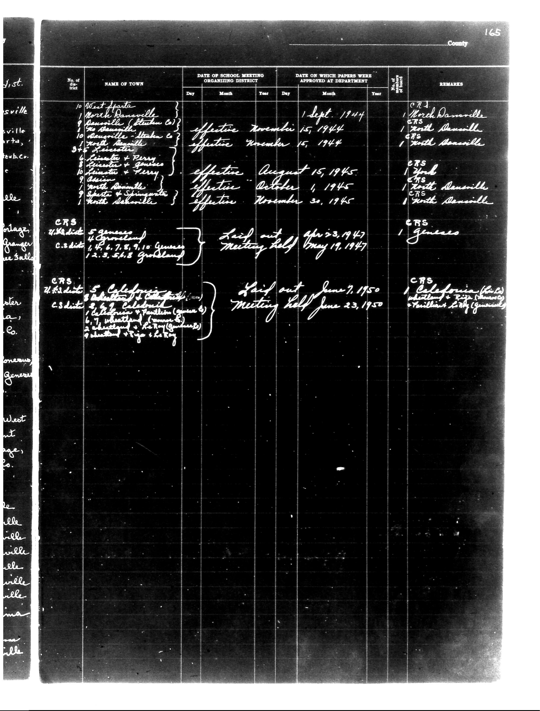

# District Consolidation Data 100 116 page 88

**Document Type:** Document

**Collection:** CS Archive

**Source:** District-Consolidation-Data_100-116_page_88.jpg

**Model:** qwen/qwen-vl-plus

**Confidence:** 1.0

**Processed:** 2025-12-19T01:47:11.027432

**Source Image:** [📄 District-Consolidation-Data_100-116_page_88.jpg](../tables/images/District-Consolidation-Data_100-116_page_88.jpg)

---

## Source Document



---

## Transcription

```
County 165

| No. of the District | NAME OF TOWN | DATE OF SCHOOL MEETING ORGANIZING DISTRICT | DATE ON WHICH PAPERS WERE APPROVED AT DEPARTMENT | REMARKS |
|---------------------|--------------|--------------------------------------------|--------------------------------------------------|---------|
|                     |              | Day Month Year                             | Day Month Year                                   |         |
| 10                  | West Anaheim | effective November 15, 1944                | 1 Sept. 1944                                     | C.R.S. 1. March Anaheimville |
| 9                   | Anaheimville (Streets C3) | effective November 15, 1944 | 1 Sept. 1944                                     | C.R.S. 1. North Anaheimville |
| 10                  | Anaheimville (Streets C3) | effective November 15, 1944 | 1 Sept. 1944                                     | C.R.S. 1. North Anaheimville |
| 3+5                 | Lancaster    | effective August 15, 1945                  | 15 Aug. 1945                                     | C.R.S. 1. Anaheim |
| 6                   | Sunkist & Perry | effective August 15, 1945                | 15 Aug. 1945                                     | C.R.S. 1. North Anaheimville |
| 9                   | Sunkist & Perry | effective October 1, 1945                | 1 Oct. 1945                                      | C.R.S. 1. North Anaheimville |
| 9                   | Sunkist & Shingwana | effective November 30, 1945 | 30 Nov. 1945                                     | C.R.S. 1. North Anaheimville |
|                     |              |                                            |                                                  | C.R.S. 1. Geneseo |
|                     |              |                                            | Laid out Apr. 23, 1947 Meeting held May 19, 1947 |         |
|                     |              |                                            |                                                  | C.R.S. 1. Geneseo |
|                     |              |                                            | Laid out June 7, 1950 Meeting held June 23, 1950 | C.R.S. 1. California (Plains) |
|                     |              |                                            |                                                  | C.R.S. 1. California (Plains) |
|                     |              |                                            |                                                  | C.R.S. 1. California (Plains) |
|                     |              |                                            |                                                  | C.R.S. 1. California (Plains) |
|                     |              |                                            |                                                  | C.R.S. 1. California (Plains) |
|                     |              |                                            |                                                  | C.R.S. 1. California (Plains) |
|                     |              |                                            |                                                  | C.R.S. 1. California (Plains) |
|                     |              |                                            |                                                  | C.R.S. 1. California (Plains) |
|                     |              |                                            |                                                  | C.R.S. 1. California (Plains) |
|                     |              |                                            |                                                  | C.R.S. 1. California (Plains) |
|                     |              |                                            |                                                  | C.R.S. 1. California (Plains) |
|                     |              |                                            |                                                  | C.R.S. 1. California (Plains) |
|                     |              |                                            |                                                  | C.R.S. 1. California (Plains) |
|                     |              |                                            |                                                  | C.R.S. 1. California (Plains) |
|                     |              |                                            |                                                  | C.R.S. 1. California (Plains) |
|                     |              |                                            |                                                  | C.R.S. 1. California (Plains) |
|                     |              |                                            |                                                  | C.R.S. 1. California (Plains) |
|                     |              |                                            |                                                  | C.R.S. 1. California (Plains) |
|                     |              |                                            |                                                  | C.R.S. 1. California (Plains) |
|                     |              |                                            |                                                  | C.R.S. 1. California (Plains) |
|                     |              |                                            |                                                  | C.R.S. 1. California (Plains) |
|                     |              |                                            |                                                  | C.R.S. 1. California (Plains) |
|                     |              |                                            |                                                  | C.R.S. 1. California (Plains) |
|                     |              |                                            |                                                  | C.R.S. 1. California (Plains) |
|                     |              |                                            |                                                  | C.R.S. 1. California (Plains) |
|                     |              |                                            |                                                  | C.R.S. 1. California (Plains) |
|                     |              |                                            |                                                  | C.R.S. 1. California (Plains) |
|                     |              |                                            |                                                  | C.R.S. 1. California (Plains) |
|                     |              |                                            |                                                  | C.R.S. 1. California (Plains) |
|                     |              |                                            |                                                  | C.R.S. 1. California (Plains) |
|                     |              |                                            |                                                  | C.R.S. 1. California (Plains) |
|                     |              |                                            |                                                  | C.R.S. 1. California (Plains) |
|                     |              |                                            |                                                  | C.R.S. 1. California (Plains) |
|                     |              |                                            |                                                  | C.R.S. 1. California (Plains) |
|                     |              |                                            |                                                  | C.R.S. 1. California (Plains) |
|                     |              |                                            |                                                  | C.R.S. 1. California (Plains) |
|                     |              |                                            |                                                  | C.R.S. 1. California (Plains) |
|                     |              |                                            |                                                  | C.R.S. 1. California (Plains) |
|                     |              |                                            |                                                  | C.R.S. 1. California (Plains) |
|                     |              |                                            |                                                  | C.R.S. 1. California (Plains) |
|                     |              |                                            |                                                  | C.R.S. 1. California (Plains) |
|                     |              |                                            |                                                  | C.R.S. 1. California (Plains) |
|                     |              |                                            |                                                  | C.R.S. 1. California (Plains) |
|                     |              |                                            |                                                  | C.R.S. 1. California (Plains) |
|                     |              |                                            |                                                  | C.R.S. 1. California (Plains) |
|
