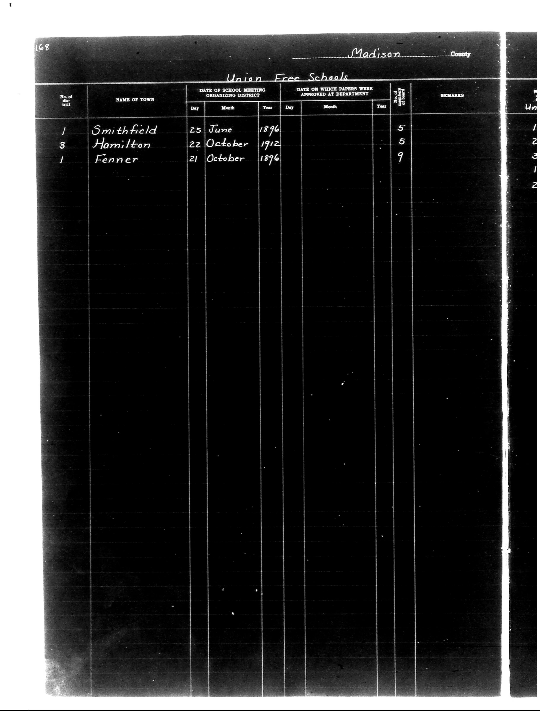

# District Consolidation Data 100 116 page 89

**Document Type:** Document

**Collection:** CS Archive

**Source:** District-Consolidation-Data_100-116_page_89.jpg

**Model:** qwen/qwen-vl-plus

**Confidence:** 1.0

**Processed:** 2025-12-19T01:47:18.745714

**Source Image:** [📄 District-Consolidation-Data_100-116_page_89.jpg](../tables/images/District-Consolidation-Data_100-116_page_89.jpg)

---

## Source Document



---

## Transcription

```
168
Madison County
Union Free Schools

| No. of District | NAME OF TOWN   | DATE OF SCHOOL MEETING ORGANIZING DISTRICT | DATE ON WHICH PAPERS WERE APPROVED AT DEPARTMENT | No. of School | REMARKS |
|-----------------|----------------|--------------------------------------------|--------------------------------------------------|---------------|---------|
|                 |                | Day   Month   Year                         | Day   Month   Year                               |               |         |
| 1               | Smithfield     | 25    June    1896                         |                                                  | 5             |         |
| 3               | Hamilton       | 22    October 1912                         |                                                  | 5             |         |
| 1               | Fenner         | 21    October 1896                         |                                                  | 9             |         |
```

**Notes:**
- The table is structured with columns for "No. of District," "Name of Town," "Date of School Meeting Organizing District," "Date on which Papers were Approved at Department," "No. of School," and "Remarks."
- The "Date of School Meeting Organizing District" and "Date on which Papers were Approved at Department" columns are further divided into "Day," "Month," and "Year."
- The "Remarks" column is blank for all entries.
- The handwritten entries are preserved as-is, including the town names and dates.
- The "No. of School" column contains numerical values for each entry.
- The rest of the table is blank, indicating no additional data is present.
