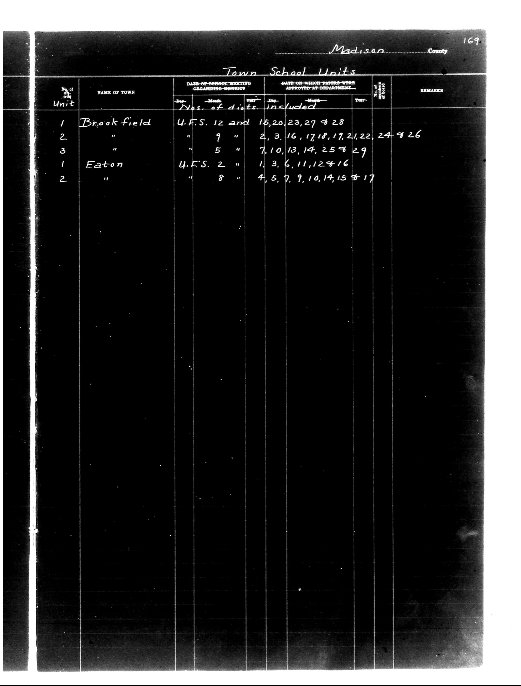

# Madison County

**Document Type:** Document

**Collection:** CS Archive

**Source:** District-Consolidation-Data_100-116_page_90.jpg

**Model:** qwen/qwen-vl-plus

**Confidence:** 1.0

**Processed:** 2025-12-19T01:47:26.663877

**Source Image:** [📄 District-Consolidation-Data_100-116_page_90.jpg](../tables/images/District-Consolidation-Data_100-116_page_90.jpg)

---

## Source Document

---

## Transcription

Madison County
169

Town School Units

| No. of Unit | NAME OF TOWN | DATE OF SCHOOL MEETING ORGANISING DISTRICT | Nos. of dists. included | DATE ON WHICH TAPERS WERE APPROVED AT DEPARTMENT | REMARKS |
|-------------|--------------|--------------------------------------------|--------------------------|---------------------------------------------------|---------|
|             |              | Dep. | Month | Year | Dep. | Month | Year | No. of dists. |         |
| 1           | Brookfield   | U.F.S. 12 and 15,20,23,27 & 28             |                          |                                                   |         |
| 2           |              | " 9 "                                      | 2, 3, 16, 17, 18, 19, 21, 22, 24 & 26 |                                                   |         |
| 3           |              | " 5 "                                      | 7, 10, 13, 14, 25 & 29  |                                                   |         |
| 1           | Eaton        | U.F.S. 2 "                                 | 1, 3, 6, 11, 12 & 16     |                                                   |         |
| 2           |              | " 8 "                                      | 4, 5, 7, 9, 10, 14, 15 & 17 |                                                   |         |
