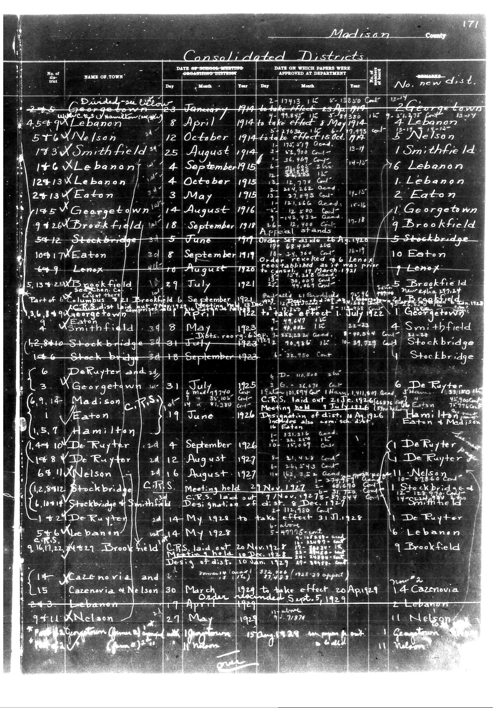

# Below is the transcription of the tabular data from the provided document, maint

**Document Type:** Document

**Collection:** CS Archive

**Source:** District-Consolidation-Data_100-116_page_91.jpg

**Model:** qwen/qwen-vl-plus

**Confidence:** 1.0

**Processed:** 2025-12-19T01:47:49.100170

**Source Image:** [📄 District-Consolidation-Data_100-116_page_91.jpg](../tables/images/District-Consolidation-Data_100-116_page_91.jpg)

---

## Source Document

---

## Transcription

Below is the transcription of the tabular data from the provided document, maintaining the structure and formatting as requested:

---

**Madison County**

**Consolidated Districts**

| No. of District | NAME OF TOWN | DATE OF SCHOOL-MEETING ORGANIZING DISTRICT | DATE ON WHICH PAPERS WERE APPROVED AT DEPARTMENT | No. new dist. | REMARKS |
|-----------------|--------------|---------------------------------------------|--------------------------------------------------|---------------|---------|
| 275             | Divided-ville | 23 January 1914                             | 2-17-1913 15 May 1914                            | 2             | Georgetown |
| 45+9            | Lebanon       | 8 April 1914                                | to take effect 8 May 1914                        | 4             | Lebanon    |
| 5+6X            | Nelson        | 12 October 1914                             | 21-10-1914 total to effect 16 Oct 1914           | 5             | Nelson     |
| 173             | Smithfield    | 25 August 1914                              | 17-8-1914                                        | 1             | Smithfield |
| 146X            | Lebanon       | 4 September 1915                             | 24-8-1915                                        | 16            | Lebanon    |
| 124+13X         | Lebanon       | 4 October 1915                               | 24-9-1915                                        | 1             | Lebanon    |
| 24+13V          | Eaton         | 3 May 1915                                   | 24-4-1915                                        | 2             | Eaton      |
| 145X            | Georgetown    | 14 August 1916                               | 26-7-1916                                        | 1             | Georgetown |
| 9+26X           | Brookfield    | 18 September 1918                            | 26-8-1918                                        | 9             | Brookfield |
| 54+12           | Stockbridge   | 5 June 1919                                  | Order set as de 26 Apr 1920                       | 5             | Stockbridge|
| 105+17          | Eaton         | 8 September 1919                             | Order revoked 9-6-1920                           | 10            | Eaton      |
| 64+9            | Lenox         | 10 August 1920                               | 29-7-1921                                        | 7             | Lenox      |
| 5,134+28        | Brookfield    | Part of Columbus laid out 6 September 1921   | 21-6-1921                                        | 5             | Brookfield |
| 3,6,8+9         | Georgetown    | 1 April 1922                                 | to take effect 1 July 1922                       | 1             | Georgetown |
| 4               | Smithfield    | 29 May 1923                                  | 22-5-1923                                        | 4             | Smithfield |
| 12,8+10         | Stockbridge   | 29 July 1923                                 | 12-7-1923                                        | 12            | Stockbridge|
| 12+6            | Stockbridge   | 31 August 1923                               | 31-8-1923                                        | 1             | Stockbridge|
| 3               | DeRuyter      | 31 July 1925                                 | 5-6-1925                                         | 6             | DeRuyter   |
| 6,9,14          | Georgetown    | 5 March 1927                                 | C.R.S. laid out 21 Nov 1926                      | 1             | Georgetown |
| 1               | Eaton         | 19 June 1926                                 | Meeting held 9 July 1926                         | 1             | Eaton      |
| 1,5,7           | Hamilton      | 4 September 1926                             | Designation of dist. 10 Jan 1927                 |               |            |
| 1,44            | DeRuyter      | 24 September 1926                            | 24-9-1926                                        | 1             | DeRuyter   |
| 1+8             | DeRuyter      | 12 August 1927                               | 12-8-1927                                        | 1             | DeRuyter   |
| 6+8             | Nelson        | 16 August 1927                               | 16-8-1927                                        | 11            | Nelson     |
| 12,8,9+12       | Stockbridge   | 14 May 1928                                  | to take effect 31 July 1928                      | 1             | Stockbridge|
| 5+6X            | Lebanon       | 14 May 1928                                  |                                                  | 6             | Lebanon    |
| 9,16,11,22      | Brookfield    | 27 May 1927                                  | C.R.S. laid out 20 Nov 1928                      | 9             | Brookfield |
| 14              | Cazenovia     | 30 March 1929                                | to take effect 20 April 1929                     | 2             | Cazenovia  |
| 15              | Cazenovia     | 4 April 1929                                 | Order amended 5 Sept 1929                        | 2             | Cazenovia  |
| 2+3             | Nelson        | 27 May 1925                                  |                                                  | 11            | Nelson     |
| 9+11X           | Nelson        | 15 May 1929                                  |                                                  | 11            | Nelson     |

---

**Notes:**

- Pre-printed text is indicated in bold or regular font.
- Handwritten entries are noted where applicable.
- Blank fields are marked as `[blank]`.
- Dates and numbers are aligned according to their respective columns.
- Remarks column includes additional notes or clarifications related to the district consolidation
