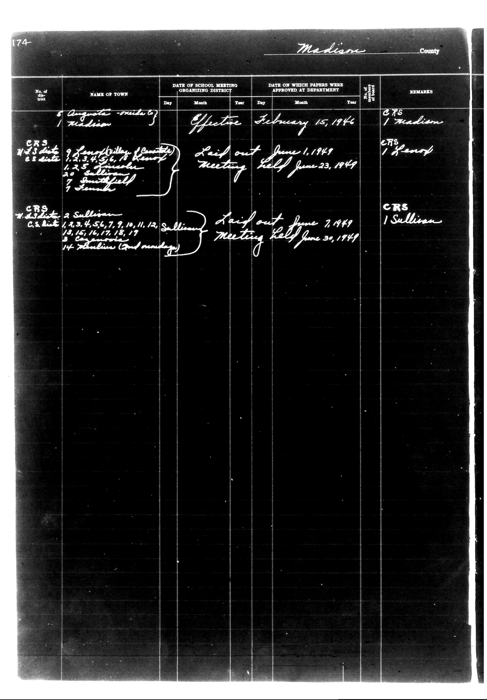

# District Consolidation Data 100 116 page 94

**Document Type:** Document

**Collection:** CS Archive

**Source:** District-Consolidation-Data_100-116_page_94.jpg

**Model:** qwen/qwen-vl-plus

**Confidence:** 1.0

**Processed:** 2025-12-19T01:48:41.644333

**Source Image:** [📄 District-Consolidation-Data_100-116_page_94.jpg](../tables/images/District-Consolidation-Data_100-116_page_94.jpg)

---

## Source Document

---

## Transcription

174
Madison County

| No. of dist. | NAME OF TOWN | DATE OF SCHOOL MEETING ORGANIZING DISTRICT | DATE ON WHICH PAPERS WERE APPROVED AT DEPARTMENT | No. of Board | REMARKS |
|--------------|--------------|--------------------------------------------|--------------------------------------------------|--------------|---------|
|              |              | Day Month Year                             | Day Month Year                                   |              |         |
| 5            | Augustus -mid to | Effective February 15, 1946              |                                                  | CRS 1 Madison|         |
|              | Madison      |                                          |                                                  |              |         |
| CRS          | N.S. dist. 9 | Laid out June 1, 1949                    |                                                  | CRS 1 Henop|         |
|              | S. dist. 8   | Meeting held June 23, 1949               |                                                  |              |         |
|              |              | 1, 2, 3, 4, 5, 6, 7, 8, 9, 10, 11, 12, 13, 14, 15, 16, 17, 18, 19, 20 Smithfield |                                                  |              |         |
|              |              | 7 Semple                                 |                                                  |              |         |
| CRS          | N.S. dist. 2 | Laid out June 7, 1949                    |                                                  | CRS 1 Sullivan|         |
|              | S. dist. 8   | Meeting held June 30, 1949               |                                                  |              |         |
|              |              | 1, 2, 3, 4, 5, 6, 7, 9, 10, 11, 12, 13, 14, 15, 16, 17, 18, 19 Sullivan |                                                  |              |         |
|              |              | 14 Semple (and sundays)                  |                                                  |              |         |
