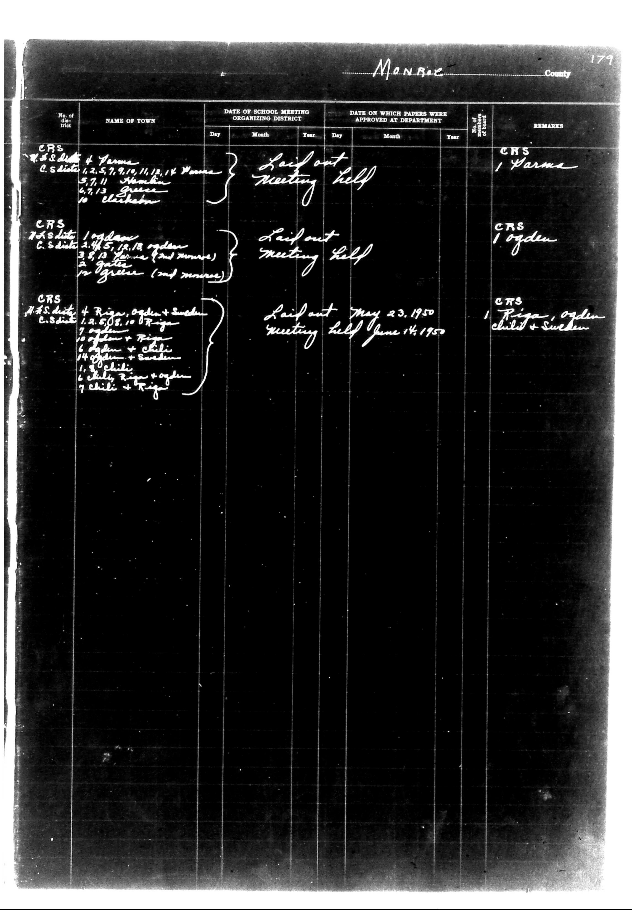

# Monroe County

**Document Type:** Document

**Collection:** CS Archive

**Source:** District-Consolidation-Data_100-116_page_97.jpg

**Model:** qwen/qwen-vl-plus

**Confidence:** 1.0

**Processed:** 2025-12-19T01:49:21.214410

**Source Image:** [📄 District-Consolidation-Data_100-116_page_97.jpg](../tables/images/District-Consolidation-Data_100-116_page_97.jpg)

---

## Source Document

---

## Transcription

Monroe County
179

| No. of the district | NAME OF TOWN | DATE OF SCHOOL MEETING ORGANIZING DISTRICT | DATE ON WHICH PAPERS WERE APPROVED AT DEPARTMENT | No. of school | REMARKS |
|---------------------|--------------|---------------------------------------------|--------------------------------------------------|----------------|---------|
|                     |              | Day | Month | Year | Day | Month | Year |                |         |
| CRS                 | W.S. dist. of Parma | [blank] | [blank] | [blank] | Laid out | Meeting held | [blank] | CRS | Parma |
|                     | C.S. dist. 1, 2, 5, 7, 9, 11, 12, 14 Women | 5, 7, 11 | Member | 6, 7, 13 | Green | 10 | Clifton | CRS | Oyden |
|                     |              |          |        |        |        |        |        | CRS | Oyden |
| CRS                 | H.S. dist. 1 Ogden | 2, 5, 12, 18 | Ogden | 3, 8, 13 | Parma (2nd meeting) | 2 | Gates | CRS | Oyden |
|                     |              |          |        |        |        |        |        | CRS | Oyden |
| CRS                 | H.S. dist. + Rigas, Ogden + Sveden | Laid out | May 23, 1950 | Meeting held | June 14, 1950 | CRS | Rigas, Ogden, Sveden |
|                     | C.S. dist. 1, 2, 5, 6, 10 | Rigas | 7 | Ogden + Rigas | 10 | Ogden + Chili | 11 | Ogden + Sveden | 12 | Chili | 13 | Ogden + Sveden | 14 | Chili | 15 | Rigas + Ogden | CRS | Rigas, Ogden, Sveden |
