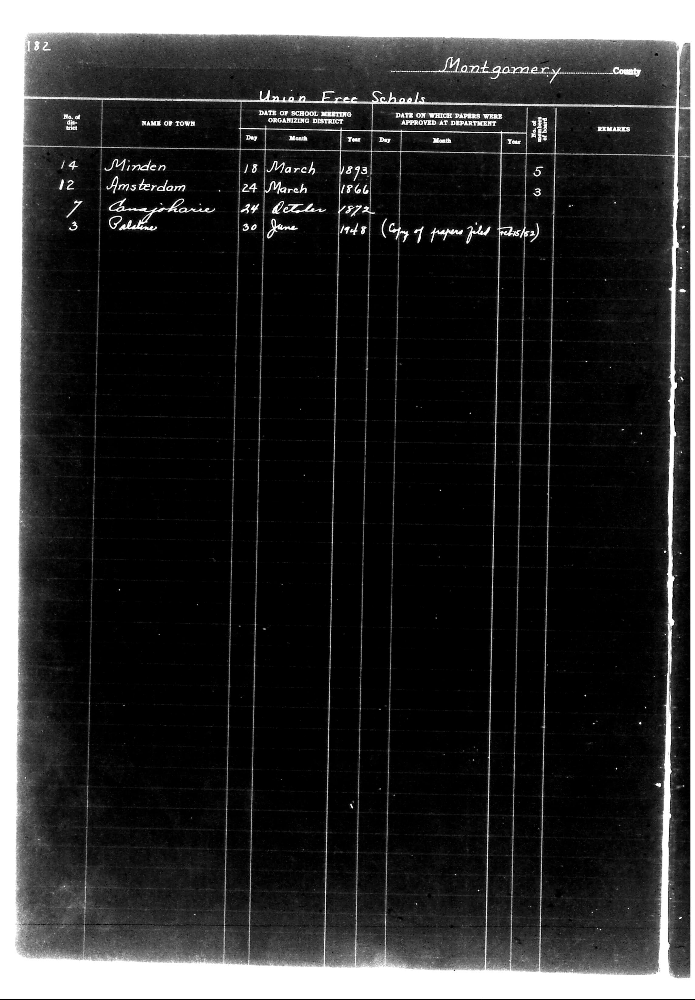

# 182                                                                 Montgomery C

**Document Type:** Document

**Collection:** CS Archive

**Source:** District-Consolidation-Data_100-116_page_98.jpg

**Model:** qwen/qwen-vl-plus

**Confidence:** 1.0

**Processed:** 2025-12-19T01:49:27.931671

**Source Image:** [📄 District-Consolidation-Data_100-116_page_98.jpg](../tables/images/District-Consolidation-Data_100-116_page_98.jpg)

---

## Source Document



---

## Transcription

```
182                                                                 Montgomery County

Union Free Schools

| No. of district | NAME OF TOWN     | DATE OF SCHOOL MEETING ORGANIZING DISTRICT | DATE ON WHICH PAPERS WERE APPROVED AT DEPARTMENT | No. of teachers | REMARKS                     |
|-----------------|------------------|--------------------------------------------|--------------------------------------------------|-----------------|-----------------------------|
|                 |                  | Day   Month   Year                         | Day   Month   Year                               |                 |                             |
| 14              | Minden           | 18    March   1893                           |                                                  | 5               |                             |
| 12              | Amsterdam        | 24    March   1866                           |                                                  | 3               |                             |
| 7               | Anajoharie       | 34    October 1872                           |                                                  |                 |                             |
| 3               | Palestine        | 30    June    1918                           |                                                  |                 | (Copy of papers filed Feb 15/62) |
```

### Notes:
- The table is structured with clear column headers.
- Pre-printed text includes "182", "Montgomery County", "Union Free Schools", and column headers.
- Handwritten entries are present for "NAME OF TOWN", "DATE OF SCHOOL MEETING ORGANIZING DISTRICT", "DATE ON WHICH PAPERS WERE APPROVED AT DEPARTMENT", "No. of teachers", and "REMARKS".
- Blank fields are indicated where no data is present.
- Alignment is maintained for dates and numbers.
