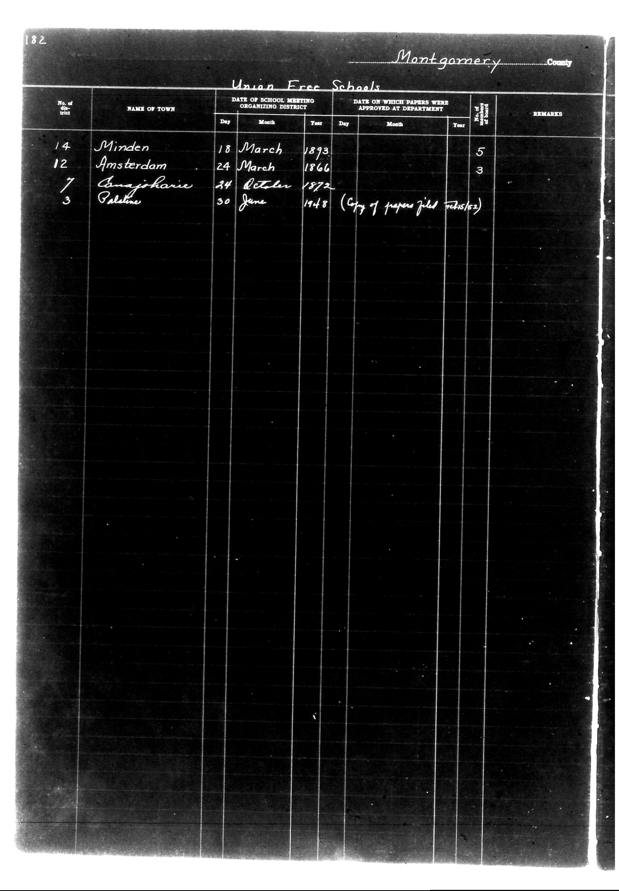

# District Consolidation Data 100 116 page 99

**Document Type:** Document

**Collection:** CS Archive

**Source:** District-Consolidation-Data_100-116_page_99.jpg

**Model:** qwen/qwen-vl-plus

**Confidence:** 1.0

**Processed:** 2025-12-19T01:49:36.062497

**Source Image:** [📄 District-Consolidation-Data_100-116_page_99.jpg](../tables/images/District-Consolidation-Data_100-116_page_99.jpg)

---

## Source Document



---

## Transcription

```
182
Montgomery County

Union Free Schools

| No. of District | NAME OF TOWN     | DATE OF SCHOOL MEETING ORGANIZING DISTRICT | DATE ON WHICH PAPERS WERE APPROVED AT DEPARTMENT | No. of Board of Trustees | REMARKS                          |
|-----------------|------------------|--------------------------------------------|--------------------------------------------------|--------------------------|----------------------------------|
| 14              | Minden           | 18 March 1893                              |                                                  | 5                        |                                  |
| 12              | Amsterdam        | 24 March 1866                              |                                                  | 3                        |                                  |
| 7               | Anajoharie       | 24 October 1872                            |                                                  |                          |                                  |
| 3               | Palekane         | 30 June 1948                               |                                                  |                          | (Copy of papers filed 1945/62)  |
```

### Notes:
- The table is structured with columns for "No. of District," "Name of Town," "Date of School Meeting Organizing District," "Date on which Papers were Approved at Department," "No. of Board of Trustees," and "Remarks."
- Handwritten entries are preserved as they appear in the document.
- Blank fields are indicated where no information is provided.
- The header "Union Free Schools" is centered above the table.
- The page number "182" is located in the top-left corner.
- "Montgomery County" is handwritten at the top-right of the document.
